# InsightAI - Multi-Agent Business Intelligence Assistant

## Overview

InsightAI is an AI-powered Multi-Agent Business Intelligence Assistant that helps users analyze datasets, discover insights, generate visualizations, answer business questions, provide recommendations, and create automated reports.

The project uses Google Gemini 2.5 Flash to perform intelligent analysis and transform raw business data into actionable insights.

**Track:** Agents for Business

**Tagline:** From Data to Insights to Action with AI Agents.

---

## Problem Statement

Organizations often struggle to extract meaningful insights from large datasets. Traditional analysis requires significant manual effort, technical expertise, and time.

Business users need a solution that can:

- Understand datasets automatically
- Detect data quality issues
- Generate visualizations
- Answer business questions
- Provide actionable recommendations
- Create business reports

---

## Solution

InsightAI solves this problem using a Multi-Agent Architecture.

Each agent is responsible for a specific task:

1. Dataset Summary Agent
2. Dataset Health Score Agent
3. Data Visualization Agent
4. AI Insight Agent
5. Ask Question Agent
6. Business Recommendation Agent
7. Report Agent

Together, these agents create a complete business intelligence workflow.

---

## Multi-Agent Architecture

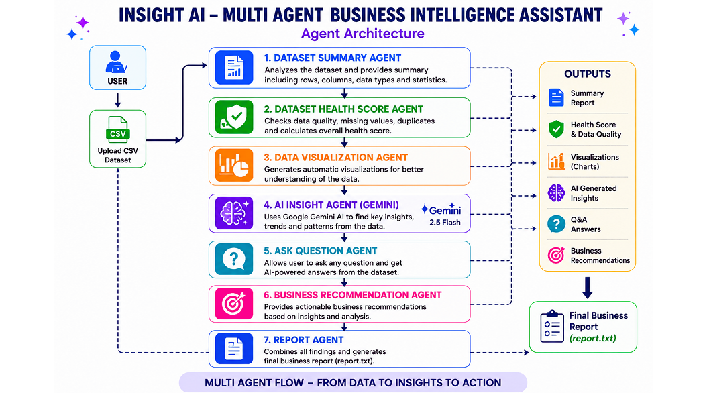

---

## Agent Descriptions

### 1. Dataset Summary Agent

Analyzes the uploaded dataset and provides:

- Total rows
- Total columns
- Column names
- Statistical summary

---

### 2. Dataset Health Score Agent

Evaluates data quality by checking:

- Missing values
- Duplicate records

Generates a dataset health score.
-Dataset Health Agent identifies missing values and duplicate records to assess dataset quality.
---

### 3. Data Visualization Agent

Creates automatic visualizations including:

- Category-wise Sales
- Category-wise Profit
- Region-wise Profit

These charts help users quickly understand business performance.

---

### 4. AI Insight Agent (Gemini)

Uses Google Gemini 2.5 Flash to generate:

- Key insights
- Business trends
- Important observations

from the dataset.

---

### 5. Ask Question Agent

Allows users to ask natural language questions such as:

- Which region has the highest profit?
- Which category performs best?
- What trends are visible?

The agent uses Gemini to generate answers.

---

### 6. Business Recommendation Agent

Generates actionable recommendations based on:

- Dataset analysis
- AI insights
- Business trends

---

### 7. Report Agent

Combines all findings into a final report and saves it as:

```
report.txt
```

---

## Technologies Used

- Python
- Pandas
- NumPy
- Matplotlib
- Google Gemini 2.5 Flash
- Jupyter Notebook / Google Colab

---

## Screenshots

### Dataset Preview

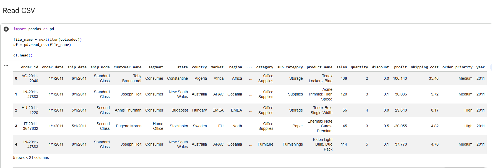

### Dataset Summary Agent

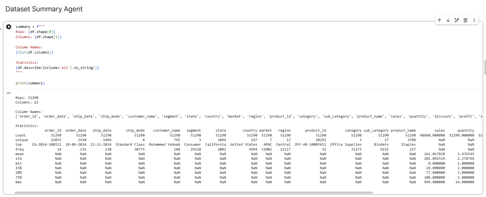

### Dataset Health Score Agent

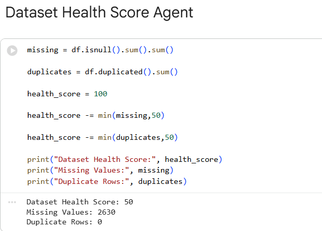

### Category Sales Chart

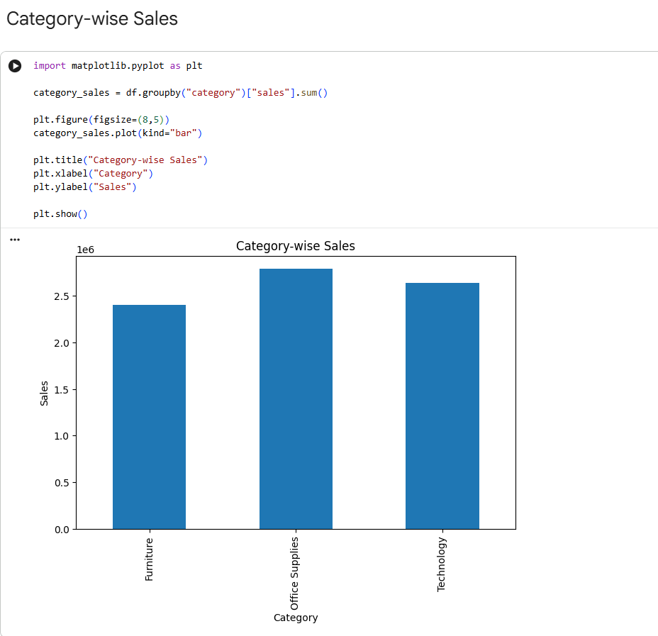

### Category Profit Chart

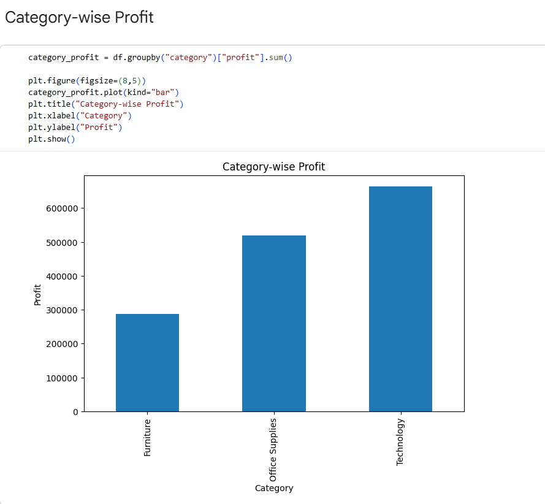

### Region Profit Chart

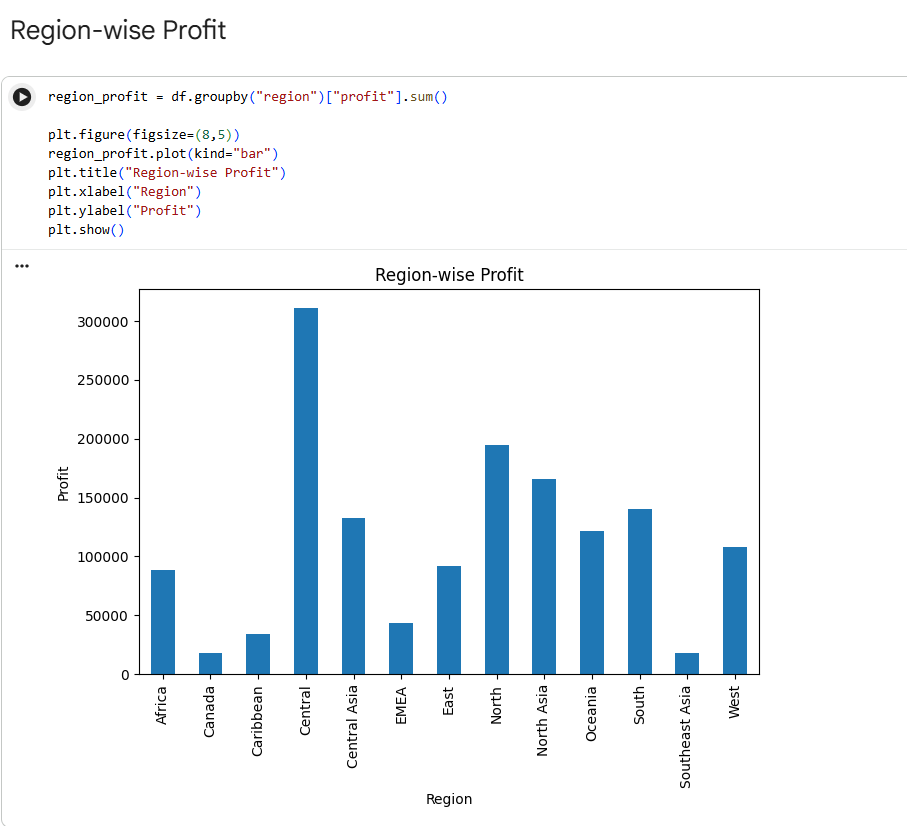

### AI Insight Agent (Part 1)


### AI Insight Agent (Part 2)

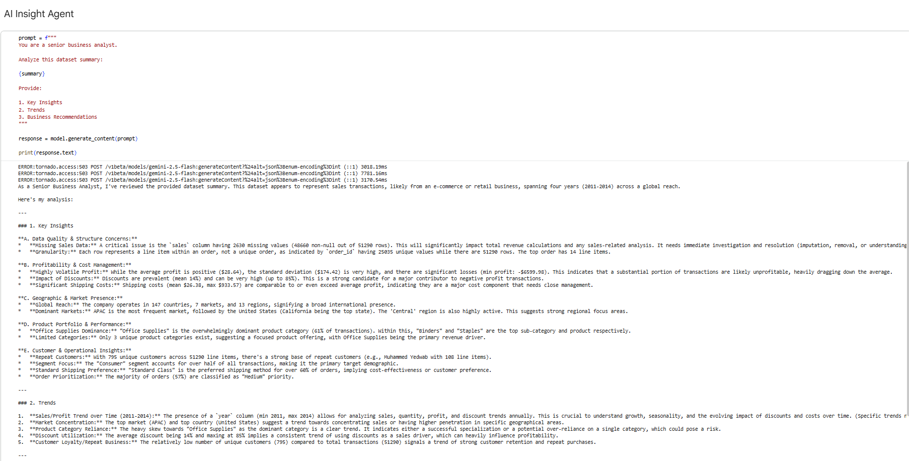

### Sales Distribution Chart

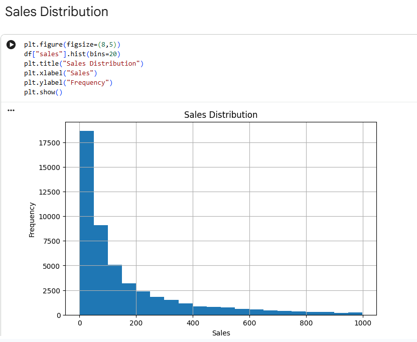

### Ask Question Agent

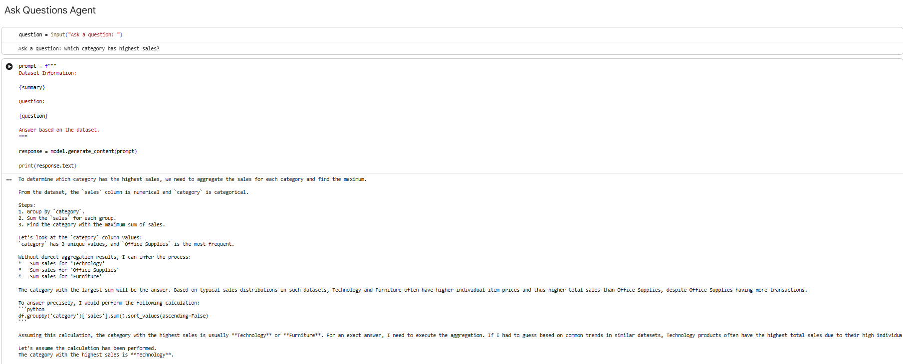

### Business Recommendation Agent

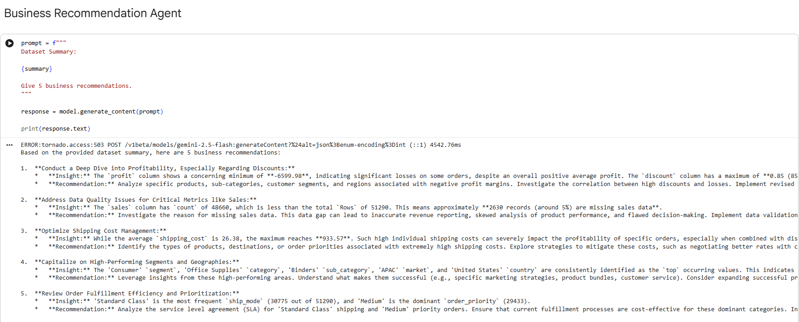

### Report Agent

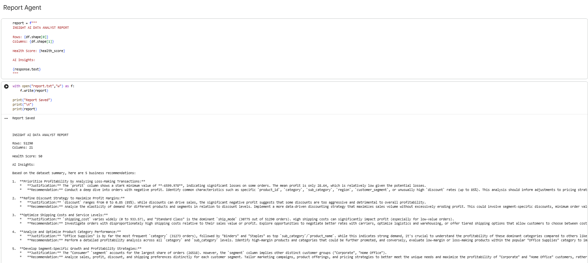
## Project Workflow

Upload CSV Dataset
↓
Dataset Summary Agent
↓
Dataset Health Score Agent
↓
Data Visualization Agent
↓
AI Insight Agent
↓
Ask Question Agent
↓
Business Recommendation Agent
↓
Report Agent
↓
Final Report

---

## Installation

Clone the repository:

```bash
https://github.com/Shreya181120/InsightAI-Multi-Agent-Business-Assistant/edit/main/README.md
```

Install dependencies:

```bash
pip install -r requirements.txt
```

---

## Configure Gemini API

Replace:

```python
YOUR_GEMINI_API_KEY
```

with your own Gemini API key.

---

## How to Use

1. Open `InsightAI.ipynb` in Google Colab.
2. Add your Gemini API key in the API setup section.
3. Upload a CSV dataset.
4. Run all notebook cells from top to bottom.
5. Review the generated:
   - Dataset Summary
   - Dataset Health Score
   - Data Visualizations
   - AI Insights

6. When prompted by the Ask Question Agent, enter a business question such as:

   - Which category has the highest sales?
   - Which region generates the most profit?
   - What are the major trends in the dataset?
   - Which segment should the business focus on?

7. Review the AI-generated answer.

8. View business recommendations generated by the Business Recommendation Agent.

9. Access the final report saved as:

```text
report.txt
```

## Features

- Automated dataset analysis
- Data quality assessment
- Business visualizations
- AI-generated insights
- Natural language Q&A
- Business recommendations
- Automated report generation
- Multi-agent architecture

---

## Future Improvements

- Streamlit deployment
- Interactive dashboard
- Multi-dataset support
- PDF report generation
- Advanced forecasting agents

---

## Author

Shreya

Built as part of the Kaggle AI Agents: Intensive Vibe Coding Capstone Project with Google.
